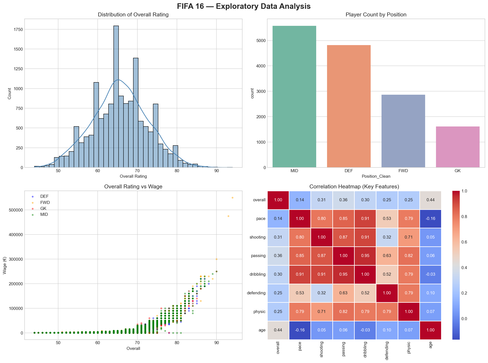
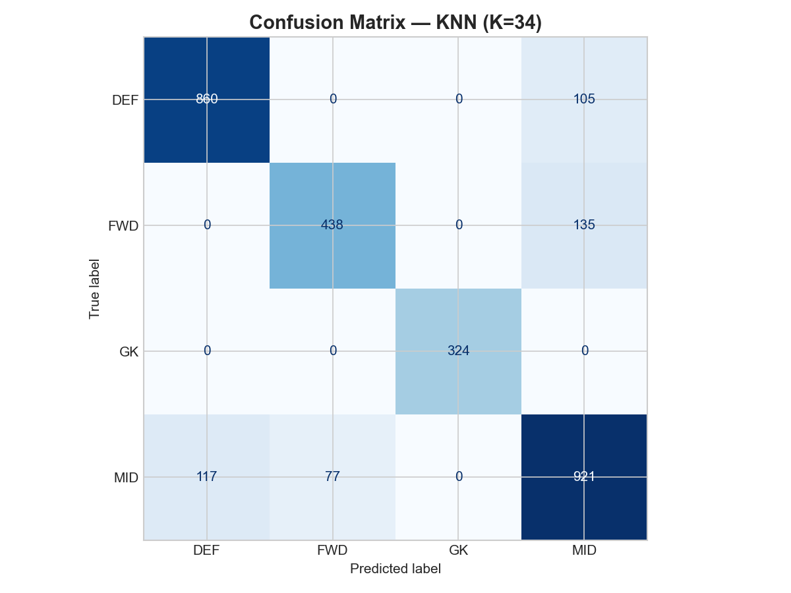

# Data Classification Using AI - Project 2

## Description
This is my second project for the DecodeLabs Industrial Training. In this project, I built a machine learning classification model using the K-Nearest Neighbors (KNN) algorithm. The goal of the model is to classify FIFA players into four main positions (GK, DEF, MID, FWD) based on their skills and stats.

## Features
* **Data Handling:** Loading and cleaning the FIFA dataset using Pandas.
* **Exploratory Data Analysis (EDA):** Visualizing data to understand player attributes.
* **Data Preprocessing:** Splitting the data into training and testing sets, and scaling features using StandardScaler.
* **Model Training:** Using the K-Nearest Neighbors (KNN) classifier.
* **Evaluation:** Testing the model's accuracy and visualizing the results using a Confusion Matrix.

## How to Run the Project
1. You need Jupyter Notebook or Google Colab to run this file.
2. Make sure you have these libraries installed: `pandas`, `numpy`, `matplotlib`, `seaborn`, and `scikit-learn`.
3. Open the `FIFA_Notebook.ipynb` file.
4. Run the cells one by one from top to bottom.

## Project Visuals & Screenshots

### Exploratory Data Analysis (EDA)

### Model Evaluation (Confusion Matrix)

## Built With
* Python 3
* Jupyter Notebook
* Scikit-Learn (Machine Learning)
